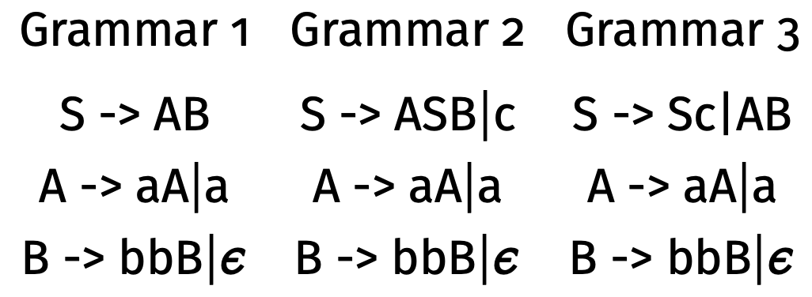

# Discussion 6 - Friday, October 4

## Reminders

1. Exam 1 on **Monday/Tuesday, October 7/8** in lecture
2. Project 3 due **Monday, October 14 @ 11:59 PM**
   
## NFAs and DFAs Review
Know the following:
- Properties of and differences between NFAs and DFAs
- How to convert Regex -> NFA/DFA and DFA/NFA -> Regex
- How to convert an NFA -> DFA using the table method

### More Regex to NFA and NFA to DFA practice!
Convert the following regular expressions to an equivalent NFA, and then convert each NFA to its equivalent DFA.
```
a) [a-c]+d{1,2}
b) ab?a|bc*
c) a*(c*b)?
```
### More NFA to DFA practice!
Convert the following NFA to its equivalent DFA.


### Resources and Extra Practice
- [NFA to DFA Practice Problems](https://bakalian.cs.umd.edu/330/practice/nfa2dfa)
- [Fall 2024 Discussion 5](https://github.com/cmsc330fall24/fall2024/blob/main/discussions/d5_nfa_dfa/README.md)
- [Slides - Reducing NFA to DFA](https://bakalian.cs.umd.edu/assets/slides/14-automata3.pdf)
- [NFA to DFA Conversion Examples](https://github.com/anwarmamat/cmsc330spring2024/blob/main/nfa2dfa/nfa2dfa.md)

## Context Free Grammars
Consider the expression and an associated CFG:
<!--
$a^xb^xc^y|a^x$ where $x \ge 0$ and $y \ge 1$
```
S -> A | B           Union of two languages
A -> CD              Concatenation of two languages
C -> aCb | ε         Related number of 0 or more  a's and b's
D -> cD | c          1 or more c's
B -> aB | ε          0 or more a's
```
-->


## Exercises

### Practicing Derivations

1. Consider the following grammar:

   ```
   S -> S + S | 1 | 2 | 3
   ```

   - Write a leftmost derivation for the string: `1 + 2 + 3`

     - Start with S and use the production rules on the LEFTMOST nonterminal ONE AT A TIME. (For a rightmost derivation, use the productions on the RIGHTMOST nonterminal.)
     - ONE NONTERMINAL AT A TIME!!!! DON'T COMBINE STEPS!!!! (or you might lose credit)

   - If there are 2 leftmost derivations or 2 rightmost for the same string in a grammar, what does that mean?

### More CFG Practice

2. Consider the following grammar:

   ```
   S -> aS | T
   T -> bT | U
   U -> cU | ε
   ```

   - Provide derivations for:

     - b
     - ac
     - bbc

   - What language is accepted by this grammar?

   - Create another grammar that accepts the same language.

3. Consider the following grammars:
   

   - Which grammar accepts both `"aaabb"` and `"aaabbcc"`?
   - Which grammar is ambiguous?

### CFG Construction

4. Construct a CFG that generates strings for each of the following:
   - $a^xb^y$, where $y = 2x$.
   - $a^xb^y$, where $y \ge 3x$.
5. Can we represent strings of the form $a^xb^xc^x$, where $x \ge 0$, with CFGs?

ඞ
